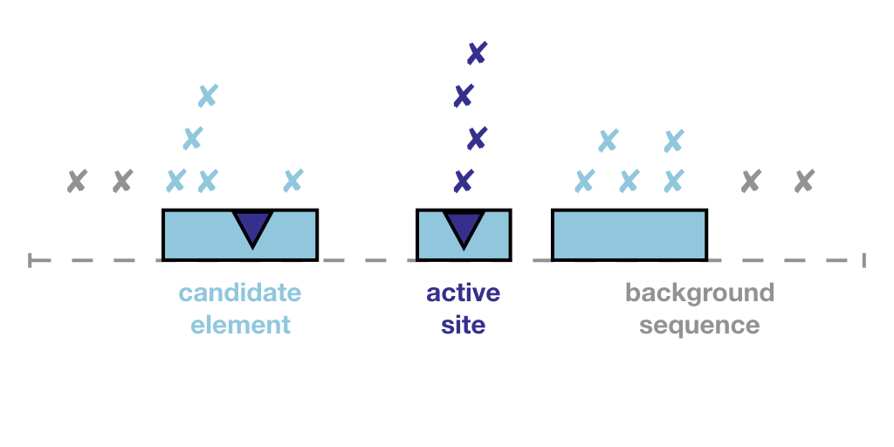

```{r setup, include=FALSE}
knitr::opts_chunk$set(echo = TRUE,
                      warning=FALSE, 
                      message=FALSE, 
                      width=500)
options(max.print=35)
```

# Introduction
Cancer is driven by somatic mutations. A few of these mutations confer a survival advantage to the tumour (drivers) while most mutations play a passive role in tumour development (passengers). Most driver mutations up to this point have been discovered in protein coding genes in whole exome sequencing datasets. Yet, as whole genome sequencing datasets grow and become the standard, novel methods are required to detect driver mutations in the vast noncoding regulatory genome. Here, we present our solution to this challenge, ActiveDriverWGS.

### The ActiveDriverWGS Model
ActiveDriverWGS analyzes the mutational burden of **SNVs and short indels** (less than 50bps) in functionally defined **elements**. These elements can include the coding regions of protein coding genes and noncoding regulatory regions such as promoters, enhancers and untranslated regions. These elements may also include **sites** of interest such as post-translational modification sites in protein coding genes, miRNA binding sites in noncoding RNAs and transcription factor binding sites in enhancers. Both regions and sites are left up to the user's preference and discretion.

\newline
ActiveDriverWGS uses a Poisson generalized linear regression to compare the mutational burden of elements against the expected mutational burden of a narrow background window, incorporating the effect of mutational signatures. In our work, we have optimized the background to be 50,000 bps upstream and downstream of elements where mutational rates which vary on a larger genomic scale can be assumed to remain constant. If an element is segmented, such as a protein coding gene which contain several exons, the inter-segment sequence is also used to calculated the expected background rate. If sites are specified, enrichment of site mutations are estimated in elements with enriched mutational burden using the same model comparing sites to element. Users also have the option to exclude hyper-mutated samples which decrease the accuracy of driver discovery.

\newline
For a more detailed reference on ActiveDriverWGS, please refer to the [preprint](https://www.biorxiv.org/content/early/2017/12/19/236802).

### Please Note
The genome build for ActiveDriverWGS is **hg19**. We are working on adding additional options for **hg38**.


```{r pressure, echo=FALSE, fig.cap="The ActiveDriverWGS Model", out.width = '75%'}

```

# Input Data
ActiveDriverWGSR requires a file for somatic `mutations` and a file for genomic `elements`. A third optional file for `sites` can be specified by the user. Elements may contain multiple segments but each element must have a unique ID.

```{r input}
library(ActiveDriverWGSR)

data("cll_mutations")
head(cll_mutations)

data("cancer_genes")
head(cancer_genes)

data("cancer_gene_sites")
head(cancer_gene_sites)

```

## Importing BED12 Files as Input Regions
For elements and sites written in BED12 files, the prepare_elements_from_BED12 function can be used to read the file and adapt it to fulfill the format requirements for the `elements` and `sites` parameters of the ActiveDriverWGS function. For more information on the BED12 format, please refer to the [UCSC guidelines](https://genome.ucsc.edu/FAQ/FAQformat.html#format1). In this example, elements are adapted from annotations for protein coding genes from [GENCODE.v19](https://www.gencodegenes.org/human/release_19.html) for chromosome 17.

```{r prepare_elements_from_BED12}
elements = prepare_elements_from_BED12(
  system.file(
    "extdata", 
    "chr17.coding_regions.bed", 
    package = "ActiveDriverWGSR", 
    mustWork = TRUE))

head(elements)
```

# Basic Use
ActiveDriverWGS can be run simply with the mutations file, the elements file and an optional sites file. In this example, mutations are adapted from the [Alexandrov et al, 2013](https://www.nature.com/articles/nature12477) dataset for chronic lymphocytic leukemia (CLL) patients. Regions are adapted from the [cancer gene census](https://cancer.sanger.ac.uk/census) and annotations for protein coding genes are adapted from GENCODE.v19.

```{r ActiveDriverWGS}

some_genes = c("ATM", "MYD88", "NOTCH1",
               "SF3B1", "XPO1", "SOCS1", 
               "CNOT3", "DDX3X", "KMT2A", 
               "HIF1A", "APC")

results = ActiveDriverWGS(mutations = cll_mutations,
                          elements = cancer_genes[cancer_genes$id %in% some_genes,],
                          sites = cancer_gene_sites)

```

## Parameter Interpretation
ActiveDriverWGS has several adjustable parameters:

1) `window_size`: A narrow background window in which mutation rates are assumed to remain constant. We have optimized this parameter on the PCAWG dataset to be 50,000 bps for SNVs and indels.

2) `filter_hyper_MB`: The threshold for the number of simple somatic mutations per megabase above which a sample is considered hypermutated. We define the default to be 30 mutations/megabase according to published literature.

3) `recovery.dir`: The directory for writing recovery files for ActiveDriverWGS. If the directory does not exist, it will be created. If none is specified, ActiveDriverWGS will create the directory ActiveDriverWGS_recovery.

4) `mc.cores`: The number of cores that the user wishes to allocate to running ActiveDriverWGS. For more information, refer to the R package [parallel](https://stat.ethz.ch/R-manual/R-devel/library/parallel/doc/parallel.pdf).

# Interpreting the Results

```{r results}
head(results)

```

ActiveDriverWGS will return results in a data frame format with the following columns.

1) `id`: The identifier for the element.

2) `pp_element`: The p-value associated with enrichment of mutations in the element.

3) `element_muts_obs`: Number of patients with mutations in the element.

4) `element_muts_exp`: Number of expected patients with mutations in the element.

5) `element_enriched`: Boolean indicating whether an enrichment of mutations is observed.

6) `pp_site`: The p-value associated with enrichment of mutations in the sites. 

7) `site_muts_obs`: Number of patients with mutations in the sites.

8) `site_enriched`: Expected number of patients with mutations in the sites.

9) `fdr_element`: FDR corrected p-value associated with the element.

10) `fdr_site`: FDR corrected p-value associated with the site.

11) `has_site_mutations`: "V" indicating the presence of site mutations


# Adapting ActiveDriverWGS to HPCCs
Compute time increases linearly with the number of samples, mutations and regions. Hence, the two main functions integral to ActiveDriverWGS have also been made available in the public domain and can be adapted by the user to their local high performance computing clusters. 

### 1. format_muts
This function formats the mutations data frame, removes hyper-mutated samples and removes non-mitochondrial mutations in extrachromosomal regions. It adds an additional column to the mutations data frame that provides the trinucleotide context of the given mutation which will be later used to estimate the mutational distribution across signatures.

### 2. ADWGS_test
This function calculates the enrichment of mutations for a particular region id. It applies a Poisson generalized linear regression model across mutation signatures to identify enriched regions.

## Example
The following example demonstrates how to build an ActiveDriverWGS pipeline which can be adapted to HPCCs. The idea is that the list of ids can be split into manageable pieces and run in parallel jobs. Note that the creation of GRanges objects is part of the ActiveDriverWGS wrapper function and must be completed manually by users wishing to create personalized pipelines. Also, note that multiple testing corrections have be recalculated in additional steps.

```{r pipeline}
library(GenomicRanges)

# Loading elements & creating a GRanges object
data(cancer_genes)
gr_element_coords = GRanges(seqnames = cancer_genes$chr,
                            IRanges(start = cancer_genes$start,
                                    end = cancer_genes$end),
                            mcols = cancer_genes$id)

# Loading sites & creating a GRanges object
data(cancer_gene_sites)
gr_site_coords = GRanges(seqnames = cancer_gene_sites$chr,
                         IRanges(start = cancer_gene_sites$start,
                                 end = cancer_gene_sites$end),
                         mocols = cancer_gene_sites$id)

# Loading mutations, format muts & creating a GRanges object
data(cll_mutations)

# format_muts
cll_mutations = format_muts(cll_mutations,
                            filter_hyper_MB = 30)

gr_maf = GRanges(cll_mutations$chr,
                 IRanges(start = cll_mutations$pos1,
                         end = cll_mutations$pos2),
                 mcols=cll_mutations[,c("patient", "tag")])

# Examplifying the ATM Element
id = "ATM"

result = ADWGS_test(id = id,
                    gr_element_coords = gr_element_coords,
                    gr_site_coords = gr_site_coords,
                    gr_maf = gr_maf,
                    win_size = 50000)

result
```

```{r remove_file, echo=FALSE}
system("rm -r ActiveDriverWGS_recovery/")
```